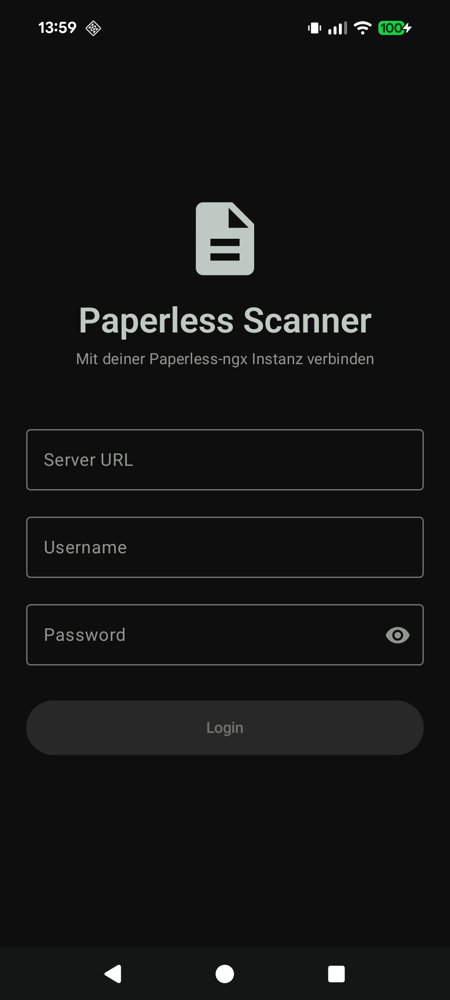
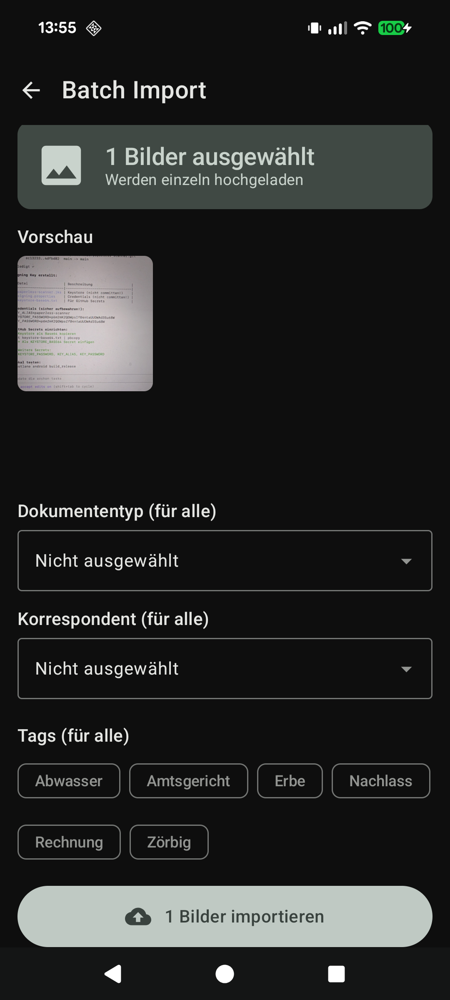

# Paperless Scanner

<div align="center">

**Native Android App for Paperless-ngx with AI-Powered Document Processing**

[](https://github.com/napoleonmm83/paperless-scanner/releases)
[](https://www.android.com)
[](https://kotlinlang.org)
[](LICENSE)

[Features](#features) • [Screenshots](#screenshots) • [Installation](#installation) • [Setup](#setup) • [FAQ](#faq) • [Contributing](#contributing)

</div>

---

## 🚀 Overview

**Paperless Scanner** is a modern, native Android client for [Paperless-ngx](https://github.com/paperless-ngx/paperless-ngx) that transforms your phone into a powerful document scanner with optional AI-powered metadata suggestions.

### Why Choose Paperless Scanner?

- **📱 Native Android App** - Fast, smooth, Material 3 design
- **🤖 AI-Powered** - Optional AI suggestions for tags, titles, and metadata (Premium)
- **🔒 Privacy-First** - No data collection, full control over your data
- **⚡ Lightning Fast** - Scan, tag, and upload in seconds
- **🌙 Beautiful UI** - Dark mode support with Material 3 design
- **📴 Offline-Capable** - Queue uploads when offline, sync automatically
- **💰 Affordable & Open Source** - Full app for just CHF 1.-, optional Premium AI

---

## ✨ Features

### Core Features (CHF 1.- one-time)

| Feature | Description |
|---------|-------------|
| **📸 Smart Scanner** | MLKit-powered document scanner with automatic edge detection |
| **⬆️ Direct Upload** | Upload directly to your Paperless-ngx instance |
| **📂 Document Browser** | Browse, search, and manage all documents with infinite scroll |
| **🏷️ Label Management** | Manage tags, correspondents, and document types |
| **📄 Multi-Page Docs** | Combine multiple scans into a single PDF document |
| **📝 Per-Page Metadata** | Assign individual metadata (tags, title, type) to each scanned page |
| **🎯 Smart Grouping** | Pages with identical metadata are automatically merged into single uploads |
| **📚 Batch Import** | Upload multiple documents in one go |
| **📋 Upload Queue** | Persistent upload queue with retry logic and progress tracking |
| **🗑️ Trash Management** | Soft delete with restore functionality |
| **🔒 App Lock** | Biometric/PIN protection with automatic lock |
| **📱 Home Widget** | Quick scan access from home screen |
| **🌙 Dark Mode** | Automatic dark/light theme following system settings |
| **📴 Offline Mode** | Queue uploads when offline, auto-sync when connected |
| **🔐 Secure** | Credentials stored securely with Android Keystore |

### Premium Features 🌟

**€4.99/month or €49.99/year** (save 2 months)

| Feature | Description |
|---------|-------------|
| **🤖 AI Tag Suggestions** | Gemini 2.0 Flash analyzes your documents and suggests relevant tags |
| **✨ Smart Metadata** | Automatic title extraction, date recognition, correspondent matching |
| **🎯 Intelligent Matching** | AI matches against your existing tags for consistency |
| **💡 New Tag Proposals** | AI suggests new tags when existing ones don't fit |
| **⚡ Time Saver** | Save 30-60 seconds per document |
| **🔄 Unlimited Usage** | Fair use policy - scan as much as you need |
| **🎁 Priority Support** | Get help faster |

### Power-User Features (Self-Hosted)

**For advanced users who want to run their own AI:**

- **🛠️ Paperless-GPT Integration** - Connect your own AI instance
- **🏠 Self-Hosted** - Full control over your AI infrastructure
- **💰 Free Alternative** - No subscription needed if you host your own
- **🔓 Open API** - Use any OpenAI-compatible endpoint

---

## 📸 Screenshots

<div align="center">

| Login | Scan | Upload | Multi-Page |
|-------|------|--------|------------|
|  |  |  |  |

| Batch Import |
|--------------|
|  |

</div>

---

## 📲 Installation

### Google Play Store (Recommended)

**Coming Soon!** The app is currently in internal testing.

<!--
[](https://play.google.com/store/apps/details?id=com.paperless.scanner)
-->

### GitHub Releases

Download the latest APK from our [Releases page](https://github.com/napoleonmm83/paperless-scanner/releases).

**Note:** APKs from GitHub are signed with a development certificate. For production use, wait for the Play Store release.

### Build from Source

```bash
# Clone the repository
git clone https://github.com/napoleonmm83/paperless-scanner.git
cd "paperless client"

# Build debug APK
./gradlew assembleDebug

# APK location:
# app/build/outputs/apk/debug/app-debug.apk
```

---

## ⚙️ Setup

### Quick Start

1. **Install the app** on your Android device (Android 8.0+)
2. **Open the app** and tap "Login"
3. **Enter your Paperless-ngx details:**
   - Server URL (e.g., `https://paperless.example.com`)
   - Username
   - Password
4. **Start scanning!** 📸

### Network Configuration

The app supports:

- ✅ **HTTPS** (recommended for remote access)
- ✅ **HTTP** for local networks only:
  - `10.x.x.x` (Class A private)
  - `172.16.x.x - 172.31.x.x` (Class B private)
  - `192.168.x.x` (Class C private)
  - `localhost` / `127.0.0.1`

**Self-Signed Certificates:** Install your CA certificate in Android's trusted certificates.

### Paperless-ngx Requirements

Your Paperless-ngx instance must support these API endpoints:

- `POST /api/token/` - Authentication
- `GET /api/tags/` - Fetch tags
- `GET /api/correspondents/` - Fetch correspondents
- `GET /api/document_types/` - Fetch document types
- `POST /api/documents/post_document/` - Upload documents

**Minimum Version:** Paperless-ngx v1.10.0 or later recommended.

### Premium Setup (AI Features)

1. **Tap the settings icon** in the app
2. **Navigate to "Subscription"**
3. **Choose your plan:**
   - Monthly: €4.99/month
   - Yearly: €49.99/year (save 17%)
4. **Complete purchase** via Google Play Billing
5. **AI features activate automatically** ✨

AI suggestions will now appear when you scan documents!

---

## 🛠️ Tech Stack

| Component | Technology |
|-----------|------------|
| **Language** | Kotlin 2.1.10 |
| **UI** | Jetpack Compose + Material 3 |
| **Dependency Injection** | Hilt |
| **Networking** | Retrofit + OkHttp |
| **Document Scanner** | MLKit Document Scanner |
| **AI Processing** | Firebase AI (Gemini 2.0 Flash) |
| **Database** | Room (offline caching + upload queue) |
| **Background Tasks** | WorkManager (queue-only uploads) |
| **Analytics** | Firebase Analytics (opt-in) |
| **Storage** | DataStore Preferences |
| **Image Loading** | Coil 3.x |
| **PDF Generation** | iText 9.x |
| **Pagination** | Paging 3 (infinite scroll) |
| **Billing** | Google Play Billing Library 8.3.0 |

---

## 🏗️ Architecture

```
app/src/main/java/com/paperless/scanner/
├── di/                          # Dependency Injection (Hilt)
│   └── AppModule.kt
├── data/
│   ├── api/                     # Retrofit API
│   │   ├── PaperlessApi.kt
│   │   └── models/              # DTOs & API Models
│   ├── repository/              # Business Logic Layer
│   │   ├── AuthRepository.kt
│   │   ├── DocumentRepository.kt
│   │   ├── TagRepository.kt
│   │   ├── CorrespondentRepository.kt
│   │   ├── DocumentTypeRepository.kt
│   │   ├── UploadQueueRepository.kt
│   │   └── AiRepository.kt
│   ├── datastore/               # Preferences & Settings
│   │   └── TokenManager.kt
│   ├── database/                # Room Database (Offline-First)
│   │   ├── dao/
│   │   │   ├── CachedDocumentDao.kt
│   │   │   ├── CachedTagDao.kt
│   │   │   ├── CachedCorrespondentDao.kt
│   │   │   ├── CachedDocumentTypeDao.kt
│   │   │   └── PendingUploadDao.kt
│   │   └── entities/            # Room Entities
│   └── sync/                    # Bidirectional Sync
│       └── SyncManager.kt
├── ui/
│   ├── theme/                   # Material 3 Theme
│   ├── navigation/              # Navigation Graph
│   └── screens/
│       ├── login/               # Login Screen + ViewModel
│       ├── home/                # Home Screen (Document List)
│       ├── scan/                # Scan Screen + ViewModel
│       ├── upload/              # Upload Screen + ViewModel
│       ├── documents/           # Document Details + Editor
│       ├── labels/              # Tags, Correspondents, Types
│       ├── queue/               # Upload Queue Management
│       ├── settings/            # Settings Screen + ViewModel
│       └── subscription/        # Subscription Screen + ViewModel
├── util/                        # Utilities & Helpers
├── MainActivity.kt
└── PaperlessApp.kt
```

**Architecture Patterns:**
- MVVM + Repository Pattern + Clean Architecture
- Offline-First with Room cache as single source of truth
- Queue-Only Upload via WorkManager (survives process death)
- Reactive Kotlin Flows for automatic UI updates

---

## 🔒 Privacy Model

**The base app sends your documents ONLY to your own Paperless-ngx instance.**

| Component | Where data goes |
|-----------|-----------------|
| Scanned documents | → YOUR Paperless server |
| Credentials | → Android Keystore (local) |
| Analytics | → Nowhere (zero tracking) |
| Crash reports | → Nowhere |

**No cloud. No LLM. No third parties.**

### Premium AI Features (Optional)

If you subscribe to Premium (€4.99/month):
- Document images are sent to Gemini 2.5 Flash Lite for tag suggestions
- You review and confirm all suggestions before upload
- Not stored permanently (per Google's API terms)

**If you don't subscribe:** The app works 100% self-hosted. Zero external services involved.

### Security Measures

- 🔐 Credentials encrypted with Android Keystore
- 🔒 HTTPS enforced for remote connections
- 🛡️ Certificate pinning support
- 🔑 Token-based authentication (no password storage)
- 🔓 Open source - audit the code yourself

[Read our full Privacy Policy](docs/PRIVACY_POLICY.md) | [Terms of Service](docs/TERMS_OF_SERVICE.md)

---

## ❓ FAQ

<details>
<summary><strong>How much does the app cost?</strong></summary>

The app costs **CHF 1.- (one-time purchase)** via Google Play. This includes all core features: scanning, uploading, document management, offline mode, and more. Optional Premium AI features are available as a subscription for power users.
</details>

<details>
<summary><strong>Do I need a subscription?</strong></summary>

No, you don't need a subscription to use the app. The one-time purchase (CHF 1.-) gives you full access to all core features. The optional Premium subscription (€4.99/month) adds AI-powered suggestions to save you time.
</details>

<details>
<summary><strong>What is Paperless-ngx?</strong></summary>

[Paperless-ngx](https://github.com/paperless-ngx/paperless-ngx) is a community-supported, open-source document management system that helps you scan, index, and archive all your physical documents. You need to host your own instance (or use a hosted solution) to use this app.
</details>

<details>
<summary><strong>Can I use my own AI instead of the Premium subscription?</strong></summary>

Yes! If you're technically savvy, you can set up [Paperless-GPT](https://github.com/icereed/paperless-gpt) or any OpenAI-compatible endpoint and configure it in the app settings. This is the "Power-User" option mentioned in our features.
</details>

<details>
<summary><strong>Why does the scanner require Google Play Services?</strong></summary>

The app uses MLKit Document Scanner, which is distributed via Google Play Services. This provides the best scanning experience with automatic edge detection and perspective correction. If you're on a device without Play Services, the app won't work (yet - we're considering alternatives).
</details>

<details>
<summary><strong>Does the app work offline?</strong></summary>

Yes! You can scan documents offline, and they'll be queued for upload. Once you're back online, the app will automatically sync them to your Paperless instance.
</details>

<details>
<summary><strong>Can I scan multi-page documents?</strong></summary>

Absolutely! After the first scan, tap "Add Page" to scan additional pages. The app will combine them into a single PDF before uploading.
</details>

<details>
<summary><strong>What data does the AI see?</strong></summary>

If you subscribe to Premium, the app sends the scanned document image to Google's Gemini AI for analysis. The AI returns suggestions for tags, title, date, and correspondent. Google doesn't permanently store your documents after processing. [Read more in our Privacy Policy](docs/PRIVACY_POLICY.md).
</details>

<details>
<summary><strong>Where can I report bugs or request features?</strong></summary>

Open an issue on our [GitHub Issues page](https://github.com/napoleonmm83/paperless-scanner/issues). We appreciate detailed bug reports with steps to reproduce!
</details>

<details>
<summary><strong>Can I use this with Paperless (old version) instead of Paperless-ngx?</strong></summary>

No, this app is designed specifically for Paperless-ngx. The original Paperless project is deprecated. We recommend [migrating to Paperless-ngx](https://docs.paperless-ngx.com/setup/#migrating-from-paperless).
</details>

---

## 🐛 Troubleshooting

### Login Issues

**Problem:** "Unable to connect to server"

- ✅ Check your server URL (must include `http://` or `https://`)
- ✅ Verify your Paperless-ngx instance is running
- ✅ Test the connection in a browser: `https://yourserver.com/api/`
- ✅ Check firewall rules if using local network
- ✅ For HTTPS with self-signed certs, install the CA certificate on your device

**Problem:** "Invalid credentials"

- ✅ Double-check username and password
- ✅ Try logging in via web interface to verify credentials
- ✅ Check for extra spaces in username/password fields

### Scanning Issues

**Problem:** "Scanner not available"

- ✅ Make sure your device has Google Play Services installed
- ✅ Update Google Play Services to the latest version
- ✅ Check device compatibility (Android 8.0+ required)

**Problem:** "Poor scan quality"

- ✅ Use good lighting conditions
- ✅ Place document on contrasting background
- ✅ Hold device steady and parallel to document
- ✅ Use the manual crop option if auto-detect fails

### Upload Issues

**Problem:** "Upload failed"

- ✅ Check your internet connection
- ✅ Verify you're still logged in (token might have expired)
- ✅ Check Paperless-ngx server logs for errors
- ✅ Try uploading a small test document first

**Problem:** "AI suggestions not appearing"

- ✅ Verify your Premium subscription is active
- ✅ Check internet connection (AI requires online access)
- ✅ Check if you've exceeded the fair use limit (see Settings → Subscription)

### Performance Issues

**Problem:** "App is slow or crashing"

- ✅ Clear app cache: Settings → Apps → Paperless Scanner → Clear Cache
- ✅ Check available storage space
- ✅ Update to the latest version
- ✅ Restart your device

---

## 🤝 Contributing

We welcome contributions! Here's how you can help:

### Reporting Bugs

1. Check [existing issues](https://github.com/napoleonmm83/paperless-scanner/issues) first
2. Use our [Bug Report template](.github/ISSUE_TEMPLATE/bug_report.md)
3. Include:
   - Android version
   - Device model
   - App version
   - Steps to reproduce
   - Expected vs actual behavior
   - Screenshots if applicable

### Suggesting Features

1. Check [existing feature requests](https://github.com/napoleonmm83/paperless-scanner/issues?q=is%3Aissue+label%3Aenhancement)
2. Use our [Feature Request template](.github/ISSUE_TEMPLATE/feature_request.md)
3. Explain:
   - What problem does it solve?
   - How should it work?
   - Why is it useful for other users?

### Contributing Code

1. **Fork the repository**
2. **Create a feature branch:**
   ```bash
   git checkout -b feature/amazing-feature
   ```
3. **Follow our coding standards:**
   - Use Kotlin idioms and best practices
   - Follow Material 3 design guidelines
   - Write unit tests for new features
   - Document public APIs
4. **Run local CI checks:**
   ```bash
   ./scripts/validate-ci.sh
   ```
5. **Commit your changes:**
   ```bash
   git commit -m "feat: add amazing feature"
   ```
6. **Push to your fork:**
   ```bash
   git push origin feature/amazing-feature
   ```
7. **Open a Pull Request**

**Coding Standards:**

- Use `data object` for sealed class singletons
- Prefer `StateFlow` over `LiveData`
- All async operations use `suspend` functions or `Flow`
- Repository methods return `Result<T>`
- Stateless Composables with state hoisting
- Follow MVVM + Repository pattern

See [docs/BEST_PRACTICES.md](docs/BEST_PRACTICES.md) for detailed guidelines.

---

## 📚 Documentation

| Document | Description |
|----------|-------------|
| [PRIVACY_POLICY.md](docs/PRIVACY_POLICY.md) | Privacy policy (DE/EN) |
| [TERMS_OF_SERVICE.md](docs/TERMS_OF_SERVICE.md) | Terms of service (DE/EN) |
| [TECHNICAL.md](docs/TECHNICAL.md) | Technical documentation & architecture |
| [API_REFERENCE.md](docs/API_REFERENCE.md) | Paperless-ngx API reference |
| [QUEUE_ONLY_ARCHITECTURE.md](docs/QUEUE_ONLY_ARCHITECTURE.md) | Upload queue architecture |
| [BEST_PRACTICES.md](docs/BEST_PRACTICES.md) | Coding standards & best practices |
| [LOCAL_CI_TESTING.md](docs/LOCAL_CI_TESTING.md) | Local CI validation guide |
| [ROADMAP.md](docs/ROADMAP.md) | Feature roadmap & future plans |

---

## 📄 License

This project is licensed under the MIT License - see the [LICENSE](LICENSE) file for details.

```
MIT License

Copyright (c) 2024-2025 Paperless Scanner

Permission is hereby granted, free of charge, to any person obtaining a copy
of this software and associated documentation files (the "Software"), to deal
in the Software without restriction, including without limitation the rights
to use, copy, modify, merge, publish, distribute, sublicense, and/or sell
copies of the Software, and to permit persons to whom the Software is
furnished to do so, subject to the following conditions:
...
```

---

## 💬 Support

- **📖 Documentation:** [docs/](docs/)
- **🐛 Bug Reports:** [GitHub Issues](https://github.com/napoleonmm83/paperless-scanner/issues)
- **💡 Feature Requests:** [GitHub Issues](https://github.com/napoleonmm83/paperless-scanner/issues)
- **💬 Community:** [r/paperless](https://reddit.com/r/paperless) or [r/paperlessngx](https://reddit.com/r/paperlessngx)
- **📧 Email:** [Contact via GitHub](https://github.com/napoleonmm83)

---

## 🙏 Acknowledgments

- [Paperless-ngx](https://github.com/paperless-ngx/paperless-ngx) - The amazing document management system this app connects to
- [MLKit](https://developers.google.com/ml-kit) - Google's ML Kit for document scanning
- [Jetpack Compose](https://developer.android.com/jetpack/compose) - Modern Android UI toolkit
- [Firebase AI](https://firebase.google.com/docs/vertex-ai) - Gemini AI integration
- All contributors and users who help improve this app!

---

## 🌟 Star History

If you find this project useful, please consider giving it a star ⭐

[](https://star-history.com/#napoleonmm83/paperless-scanner&Date)

---

<div align="center">

**Made with ❤️ for the Paperless-ngx community**

[⬆ Back to Top](#paperless-scanner)

</div>
